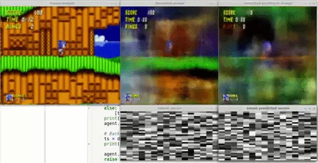

# world-models-sonic-pytorch

My attempt to implement an unsupervised dynamics model with ideas from a few papers
- ["World Models"](https://arxiv.org/abs/1803.10122)
- ["MERLIN "or "Unsupervised Predictive Memory in a Goal-Directed Agent"](https://arxiv.org/abs/1803.10760 )
- ["Decoupling Dynamics and Reward for Transfer Learning"](https://arxiv.org/abs/1804.10689)
- ["Curiosity-driven Exploration by Self-supervised Prediction"](https://arxiv.org/abs/1705.05363)

I use a dynamics model, an inverse model, and a VAE. For the controller I use Proximal Policy Optimization (PPO).

I also use Curiosity as a auxillary reward. The theory is that we like to see/listen to things that we can learn from, but then we don't want to see them again because we've learnt all we could. There's more about [that theory here](http://people.idsia.ch/~juergen/creativity.html).

One way to frame this in reinforcement learning is by rewarding a controller for finding novel states and giving them to the world model. Then we measuring how much the loss reduces before and after training. That's out reward (There are probably better ways to frame it).

So I tried that... but the agent liked to stand in place and fill a whole rollout with one frame. Until it had learnt all it could. Then it would casually stroll a little way, and overfit to it's new environment.

The end result was a score of ~2400/9000 and place ~#200 on the leaderboard to the [openai retro competition](https://contest.openai.com/).

## Sources of code

- implementations, which I got code and ideas from
    - https://github.com/AppliedDataSciencePartners/WorldModels
    - https://github.com/JunhongXu/world-models-pytorch
    - https://github.com/goolulusaurs/WorldModels
    - https://github.com/ShangtongZhang/DeepRL
    - https://github.com/hardmaru/pytorch_notebooks/blob/master/mixture_density_networks.ipynb

## Setup

- requirements (see `./requirements/requirements.txt`)
    - [openai/retro](https://github.com/openai/retro)
    - [openai/gym_remote (from retro-contest)](https://github.com/openai/retro-contest)
    - [openai/retro-baselines](https://github.com/openai/retro-baselines/blob/master/agents/ppo2.docker)

- roms: you need the ROM files for the Sonic games
    - install from steam
        - [Sonic The Hedgehog](http://store.steampowered.com/app/71113/Sonic_The_Hedgehog/)
        - [Sonic The Hedgehog 2](http://store.steampowered.com/app/71163/Sonic_The_Hedgehog_2/)
        - [Sonic 3 & Knuckles](http://store.steampowered.com/app/71162/Sonic_3__Knuckles/)
        - so download rom files run [this](https://github.com/openai/retro/blob/master/retro/scripts/import_sega_classics.py) then find the rom files in path given by `retro.data_path()`
    - do not get from these links (unless you already have the license to these specific versions and that gives you the rights in your country)
        - [Sonic The Hedgehog (Japan, Korea).md](http://www.completeroms.com/dl/sega-genesis/sonic-the-hedgehog-japan-korea/151020)
        - [Sonic The Hedgehog 2 (World) (Rev A).md](http://www.completeroms.com/dl/game-gear/sonic-the-hedgehog-2-u-/7772)
        - [Sonic & Knuckles + Sonic The Hedgehog 3 (USA).md](http://www.completeroms.com/dl/sega-genesis/sonic-and-knuckles-sonic-3-jue-/1824)

### Running

I have included the pretrained models in releases

- `04_train_PPO_v4-all-curiosity.ipynb` to train from scratch. Run if with verbose=True to see the performance.

## Hyperparameters

### Loss weights

The model uses joint training for the VAE, forward, and inverse models (https://arxiv.org/abs/1803.10122). This introduces a few new hyperperameters, but at of 20180520 there is no information on how to set these. The parameters are lambda_vae and lambda_finv.

We want changes to be within an order of magnitude, and we preffer loss VAE to be optimised preferentially, then mdnrnn, then finv. So we want to set it so that loss_vae is large.

For example, if the mdnn is optimised over the VAE, the VAE will learn to output blank images, which the mdnrnn will predict with perfect accuracy. Likewise if the finv is optimised preferentially, the model will only learn to encode the actions in blank images. There are unsatisying local minima.

To set them, you should run for a few epochs with them set to 1, then record the three components of the loss. For example you might get loss_vae=20,000, loss_mdnrnn=3, loss_finv=3. In this case I would set lambda_vae=1/1,00, and the other to one. Keep and eye on the balance between them and make sure they don't get too unbalanced, eventually my unbalanced losses were around loss_vae=2000, loss_mdnrnn=-2, loss_finv=0.1. This means the loss reduction of each was 1800, 5, and 2.5, and the balances loss reductions were 18, 5, and 2.9. All values within an order of mangitude and in an order which follows our preferences.

### Learning rate

Other hyperparamers can sometimes needs to be tweaked. A small learning rate may be needed to initially train the VAE, say 1e-5. Then a higher one may be needed to get the MDRNN to convert, say 3e-4.

Overall it can take quite a small learning rate to train multiple network simulataneusly without being to high on any of them.

### Curiosity weights

I haven't found optimal setting for these but you can leave the settings at default values.
